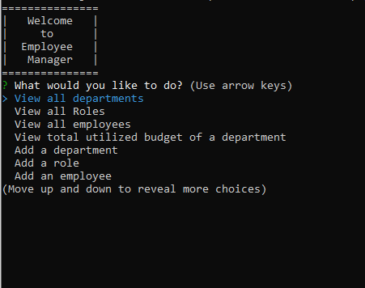

# Employee Manager &copy;

## Description 

A database manager that allows you to store data on Employees, Roles and Deparments.

## Table of Contents (Optional)

If your README is very long, add a table of contents to make it easy for users to find what they need.

* [Installation](#installation)
* [Usage](#usage)
* [License](#license)

## Installation

1. Clone repository
2. Extract From zip
3. Run npm Install

## Usage 

1. Open command prompt to root file
2. Run node app.js

[Example Video](https://youtu.be/TyvDLmWAeZQ)

## License

Copyright 2021 &copy;

## Features

* View Database
* Add to Database
* Update Database
* Delete from Database
